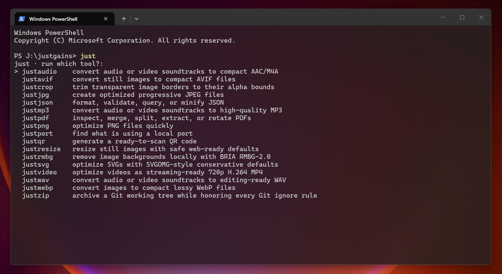

# JustTools

Fast, opinionated, cross-platform `just*` commands in one compiled Rust
executable. There is no Node, Bun, or PowerShell runtime layer. `just install`
creates native aliases, so the same binary runs as `justjson`, `justpdf`,
`justvideo`, `justready`, `bunt`, and every other command.

> JustTools is built by the team behind [JustGains](https://justgains.com).
> Try JustGains for a fast, focused way to build workouts, track progress, and
> get stronger.



## Install

Install the correct published release archive, verify its SHA-256 checksum, install
all native aliases, and open JustReady with one command:

```powershell
irm https://raw.githubusercontent.com/JustGains/JustTools/main/ready.ps1 | iex
```

```sh
curl -fsSL https://raw.githubusercontent.com/JustGains/JustTools/main/ready.sh | sh
```

The PowerShell command supports Windows x64/ARM64. The shell command supports
macOS and Linux on x64/ARM64 and also works with `wget` after the script is
downloaded. Both bootstraps refuse an archive with a missing/mismatched release
checksum and verify that the selected release contains JustReady before
changing an existing installation.

To build from a local clone instead, let the binary install itself:

```powershell
cargo build --locked --release -p justtools
.\target\release\just.exe install
```

```sh
cargo build --locked --release -p justtools
./target/release/just install
```

The default destination is `C:\cmd\bin` when that directory already exists on
Windows, otherwise the per-user application directory on Windows and
`~/.local/bin` on macOS/Linux. Override it with `--bin-dir` or
`JUSTTOOLS_BIN`. Existing managed JustTools files are moved to a timestamped
recovery directory before the staged native install commits. A failed upgrade
rolls the prior installation back.

If the install directory is not on `PATH`, the `just` browser offers
**Add To Path**. The direct commands are `just add-to-path` and
`just install`. Open a new terminal after changing `PATH`.

Bootstrap overrides are optional: `JUSTTOOLS_VERSION=v2.4.0` pins a release,
`JUSTTOOLS_BIN` selects the install directory, and `JUSTREADY_NO_RUN=1` installs
without opening the picker. `JUSTTOOLS_ARCHIVE` points either bootstrap at a
local release archive, which makes the same install path directly testable from
this repository.

## Commands and defaults

| Command | Opinionated default |
| --- | --- |
| `just` | Browse or directly dispatch every command; offer Add To Path when needed |
| `justaudio` | AAC-LC M4A, 160 kb/s, 48 kHz; keep the source |
| `justavif` | AV1 still image, quality 60, speed 6; install only when smaller |
| `justbunt` / `bunt` | Smart TUI to inspect, persistently protect, and stop Node/Bun/Python processes |
| `justcommit` | Stage the worktree, generate a bounded AI summary/message, commit, and optionally push |
| `justcrop` | Trim transparent borders per image or use folder-wide shared bounds for aligned animation frames |
| `justjpg` | Quality 85 progressive 4:2:0 JPEG, optimized Huffman tables, white alpha background |
| `justjson` | Pretty-print in place with two spaces and a final newline |
| `justmp3` | LAME VBR quality 2, 48 kHz; keep the source |
| `justpdf` | Show info for one PDF or merge several into `merged.pdf` |
| `justpng` | pngquant quality 65-90, speed 3; replace only when smaller |
| `justport` | Show the owner of exact local ports; guarded same-user kill is optional |
| `justqr` | 1024 px, error-Q, four-module margin, black-on-white `qr.png` |
| `justready` | OS-aware curated software picker with installed-state detection and dependency planning |
| `justresize` | Fit still images within 1920x1920, never upscale, preserve format and source |
| `justrmbg` / `rmbg` | Local BRIA RMBG-2.0 removal to `<name>-nobg.png`; Auto provider selection |
| `justsvg` | Conservative multipass SVGOMG-style optimization, precision 3 |
| `justvideo` | 720p H.264 MP4, CRF 28, medium preset, AAC 128 kb/s |
| `justwav` | Stereo 16-bit PCM WAV at 48 kHz; keep the source |
| `justwebp` | Quality 82, method 5 WebP; replace only when smaller |
| `justzip` | Smallest-compression ZIP from Git's exact tracked/unignored file set |

Run `just`, `just --help`, or `just help qr`. Short dispatch stays quick:

```sh
just qr "https://example.com"
just crop transparent-logo.png
just jpg photo.png
just resize photo.jpg --width 1200
just json package.json
just pdf report-a.pdf report-b.pdf
just mp3 interview.mov
just port 4321
just ready --list
just rmbg portrait.jpg
just rmbg --check
just bunt
just commit --dry-run
```

`justbunt`, `bunt`, and `just bunt` open the same process manager. Press `e`
to persistently protect the selected workload and `K` to stop every current
non-protected target. Its PID-reuse checks, launcher-ancestry protection,
stable table ordering, smart filtering, and responsive staged shutdown flow are
described in the [bunt guide](docs/bunt.md).

## JustCommit

`justcommit` and `just commit` stage the complete working tree by default, turn
the resulting Git index into a concise summary and commit message, then run
`git commit`. Set `OPENROUTER_API_KEY` once or pass
`--api-key`; choose any OpenRouter model with `--model`. The default is
`google/gemini-2.5-flash-lite:nitro`, selected for its low price, low latency,
and high throughput on OpenRouter. Use `--dry-run` to stop before committing or
pushing, or `--staged` to preserve an existing staged selection.

```sh
justcommit
justcommit --dry-run
justcommit --push
justcommit --staged
justcommit --model google/gemini-3.1-flash-lite
```

Large repositories stay fast because the complete name/status stream is counted
incrementally while only fixed-size path metadata and at most twelve separately
capped text patches reach the model. Binary, generated, dependency, credential,
and likely-secret files never contribute patch contents. JustCommit prefers
`.cursor/rules/git-commit-structure.mdc`, falls back to `.gitmessage`, and checks
that the index did not change before committing. `--staged` preserves an
existing staged selection; `--push` runs the repository's normal `git push`
after a successful commit. See the
[JustCommit guide](docs/commit.md) for exact bounds, staging behavior, model
selection, privacy, and `--repair` error handoff.

## JustReady software setup

`justready` and `just ready` open a Ninite-style terminal catalog built for
Windows, macOS, and Linux. It shows only software supported on the current OS,
organizes apps into Essentials, AI & Agents, Editors & Terminals, Runtimes &
Containers, Data & API, Communication, Browsers, Utilities, and Creative, and
marks the opinionated starter set with `★`.

The recommended set includes GitHub Desktop where supported, GitHub CLI, Git,
Codex CLI, Claude Code, the Claude desktop app where supported, Zed, .NET SDK
10, Notion where supported, Telegram, DBeaver, and the Windows-only ShareX,
Windhawk, and Everything. The wider catalog includes tools such as Bitwarden,
Tailscale, Ollama, VS Code, Node.js, Python, Bun, Rust, Go, Docker, Postman,
Bruno, Firefox, Chrome, Brave, 7-Zip, PowerToys, VLC, OBS, GIMP, and Inkscape.

```sh
justready
justready --list
justready --json
justready --install github,github-cli,git
justready --install codex,claude-code,zed --dry-run
justready --recommended --yes
```

Installed-state discovery runs once in the background, so the picker appears
immediately and rows never jump while results arrive. Installed apps are
read-only. Press `r` to select missing recommendations, `/` to search, `Tab` to
jump sections, and `Enter` to review the complete plan.

JustReady uses WinGet on Windows, Homebrew on macOS, and the native distro
manager plus Flathub or official installers on Linux. Missing WinGet, Homebrew,
Flatpak, Flathub, `curl`, or `bash` prerequisites are included in the review plan. The
TUI restores the terminal before execution, leaving UAC/password prompts and
native installer progress fully visible. See the [JustReady guide](docs/ready.md)
for the catalog, dependency model, automation contract, and keys.

## Consistent file handling

- File tools accept files, folders, Unicode paths, and `--` before unusual path
  names. Folder scans are direct unless `--recursive` is selected.
- Batch tools consistently expose `--output`, `--yes`, `--dry-run`, and
  `--help`; encoders also expose `--jobs`.
- Inputs are normalized and deduplicated. Output collisions and input/output
  overlap are rejected before processing.
- Outputs are written beside their destination and atomically installed.
  Existing modes are preserved for in-place document edits.
- Destructive folder operations ask once. Explicit-file operations remain
  low-friction, while `--yes` makes automation intentional.
- Audio tools keep sources unless `--replace` is explicit. WebP and AVIF remove
  a beside-source original only after a smaller replacement is complete.
- APNG, animated WebP/AVIF, multi-page TIFF, and AVIF transparency are rejected
  where a still-image conversion would silently discard content.
- Crop applies EXIF orientation, trims to alpha values above the selected
  threshold, clamps optional padding to the original canvas, and reduces fully
  transparent canvases to a valid 1x1 transparent image.
- JPG applies EXIF orientation, composites transparency onto white by default,
  writes progressive 4:2:0 output with optimized Huffman tables, and strips
  metadata. Quality 90+ switches to full 4:4:4 chroma. Use `--background`,
  `--quality`, or `--baseline` when needed.
- Resize applies EXIF orientation, uses Lanczos3, strips metadata, and preserves
  aspect ratio unless exact center-cropping is explicitly selected.
- PDF inputs are never deleted. Page ranges are one-based, such as
  `1-3,5,last`.
- ZIP paths, symlinks, output self-inclusion, Git submodules, and ZIP64 files
  are handled explicitly; unsafe links that escape the archive root fail closed.

`justjson` and `justsvg` treat piped input as document content. `justqr` treats
piped input as text. Media, PDF, and RMBG commands accept paths; see each
command's `--help` for its exact batch behavior.

`justsvg` uses OXVG, a Rust-native optimizer modeled on SVGO/SVGOMG. Its
conservative preset preserves IDs, `viewBox`, titles, descriptions, XML
namespaces, and accessibility attributes.

Third-party attribution for the native JPEG encoder ships in
[`THIRD_PARTY_LICENSES.md`](THIRD_PARTY_LICENSES.md) and every release archive.

## Dependencies: discover, explain, confirm

Pure-Rust bunt, crop, JPG, JSON, PDF, QR, resize, SVG, and port operations have
no external runtime dependencies. Other commands resolve dependencies only
when invoked:

| Commands | Dependency | Confirmed acquisition |
| --- | --- | --- |
| audio, AVIF, MP3, video, WAV | FFmpeg + ffprobe | WinGet, Homebrew, apt, dnf, or pacman |
| PNG | pngquant | package manager, or checksum-pinned official Windows archive |
| WebP | `cwebp` | WinGet or the platform WebP package |
| ZIP | Git | native package manager |
| Commit | Git + OpenRouter API key | Git via native package manager; key supplied by the user |
| RMBG | ONNX Runtime + BRIA model | checksum-pinned official Microsoft runtime packages, then the checksum-pinned `m.justgains.com` model archive |

When something is missing, JustTools prints the exact source and command, then
asks `[y/N]`. It runs the installer only after a real `y`/`yes` from an
interactive terminal. Redirected input, CI, and other non-interactive runs
never install or download anything; they return actionable instructions
instead. Declining leaves the filesystem unchanged.

For file-processing commands, dependency installation cannot be bypassed with
`--yes`. That flag applies to the requested file operation or JustTools' own
managed install, not its third-party dependency prompt. Override discovery
without enabling installation by setting
`FFMPEG_BIN`, `FFPROBE_BIN`, `PNGQUANT_BIN`, `CWEBP_BIN`, or `GIT_BIN` to a
specific executable.

`justready` is the intentional exception: installing third-party software is
its entire purpose. It always prints or renders the full plan first; `--yes`
confirms that displayed plan for automation. Native UAC, `sudo`, or installer
prompts can still appear.

The Fedora `ffmpeg-free` package can omit `libx264`, `libmp3lame`, or
`libaom-av1`. JustTools warns before installation and verifies the exact encoder
needed by the current command before touching inputs.

## RMBG runtime and model

The easy path is `justrmbg image.jpg`. Before processing anything, run
`justrmbg --check`: it resolves the native runtime, creates an ONNX session, and
runs a tiny real inference without requiring an image or resolving or downloading
the large BRIA model. Its output identifies the requested and selected providers,
the canonical runtime path and source, failed provider attempts, and any fallback.
Provider registration and this probe confirm execution-provider operation, not
which physical GPU adapter performed the work or whether the full BRIA graph is
compatible with strict provider-only execution.

Provider selection is explicit when needed:

```sh
justrmbg image.jpg                         # Auto; acceleration preferred, CPU use disclosed
justrmbg --check --gpu                    # strict platform GPU; never CPU
justrmbg image.jpg --provider cpu         # strict CPU
justrmbg image.jpg --provider directml    # strict DirectML
justrmbg image.jpg --provider cuda        # strict CUDA
justrmbg image.jpg --provider coreml      # strict CoreML
```

`--provider` accepts `auto`, `cpu`, `directml`, `cuda`, or `coreml`. `--cpu` is
an alias for strict CPU. `--gpu` is strict DirectML on Windows, CoreML on macOS,
and CUDA elsewhere. Explicit GPU requests never silently execute nodes on CPU.
Auto may use CPU for model nodes an accelerator cannot execute, or fall back
entirely to CPU; it reports either case and updates the selected provider after
a full fallback.

On Windows x64, Auto can install a managed DirectML runtime assembled from
checksum-pinned official Microsoft ONNX Runtime DirectML and DirectML packages.
The complete flavor-specific cache—including companion DLLs, licenses, notices,
and its manifest—is verified before reuse. A partial or corrupt cache is repaired
only through the normal confirmed download path. Other platforms use the managed
portable CPU runtime by default. CUDA and CoreML remain advanced bring-your-own
options: set `ORT_DYLIB_PATH` to the **absolute path** of a compatible,
provider-enabled ONNX Runtime library and supply its matching native dependencies.
Relative paths and Windows PATH-only/bare-DLL discovery are intentionally rejected
to prevent loading an unintended runtime such as a private System32 copy.

Runtime acquisition is offered only in an interactive terminal and is verified by
exact byte size and SHA-256 before atomic installation. A non-interactive process
never downloads a missing dependency. `ORT_DYLIB_PATH` is authoritative and
resolve-only; JustTools does not replace the runtime it names.

After the runtime is ready, the BRIA RMBG-2.0 archive is fetched from
`https://m.justgains.com/tools/rmbg-2.0.zip`, verified by SHA-256, selectively
extracted, and installed atomically in the per-user cache. Use `--model` or
`RMBG_MODEL` for an existing ONNX file. Custom mirrors require both
`RMBG_MODEL_ARCHIVE_SHA256` and `RMBG_MODEL_SHA256` alongside
`RMBG_MODEL_URL`.

BRIA publishes the RMBG-2.0 weights for non-commercial use. Commercial use
requires a separate agreement; review the
[BRIA model card and license](https://huggingface.co/briaai/RMBG-2.0) before
using the downloaded weights.

## Agent skill

The repository includes an installable `justtools` Agent Skill at
`skills/justtools`. The [`skills` npm CLI](https://www.npmjs.com/package/skills)
discovers it directly from GitHub:

```sh
npx skills add JustGains/JustTools --skill justtools
```

Target specific agents or install globally when desired:

```sh
npx skills add JustGains/JustTools --skill justtools --agent codex --agent claude-code
npx skills add JustGains/JustTools --skill justtools --agent codex --global
```

Use `npx skills add . --skill justtools` from a local clone while developing the
skill. Set `DISABLE_TELEMETRY=1` if you do not want the installer's anonymous
usage telemetry.

After installation, invoke the skill explicitly with `$justtools` in Codex or
`/justtools` in Claude Code. Both agents may also select it automatically when a
request names JustTools or clearly matches one of its operations.

## Development and releases

```sh
cargo fmt --all -- --check
cargo check --locked --workspace --all-targets
cargo test --locked --workspace --all-targets
cargo clippy --locked --workspace --all-targets -- -D warnings
cargo build --locked --release -p justtools
```

The test suite exercises every advertised command through the root binary,
native alias installation and rollback, non-interactive dependency refusal,
real JSON/PDF/QR/SVG/port behavior, JustReady catalog/planning/TUI states,
bunt filtering/configuration/TUI states, bounded JustCommit scanning and a real
Git commit through a local OpenRouter-compatible test server,
Git-accurate ZIP creation, media safety, native crop/JPG/resize behavior, and
offline RMBG acquisition logic. CI also
checks the Rust 1.90 minimum and builds
native release archives for Windows x64/ARM64, Linux x64/ARM64 on an Ubuntu
22.04 compatibility baseline, and macOS Intel/Apple Silicon. Unix artifacts are
tarred so executable permissions survive artifact transport. Workflow actions
use their current Node 24-based major releases.

Every push and pull request keeps its native archives and SHA-256 sidecars on
the Actions run. CI exercises `ready.ps1` or `ready.sh` against each packaged
archive before upload. A version tag matching `Cargo.toml`, such as `v2.4.0`,
additionally creates a GitHub Release and attaches all six archives and their
checksums. Re-running the release job safely
replaces its existing assets.
