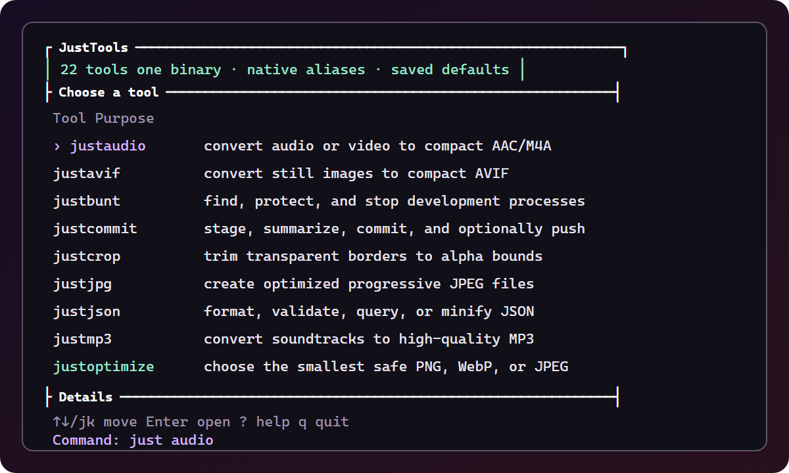
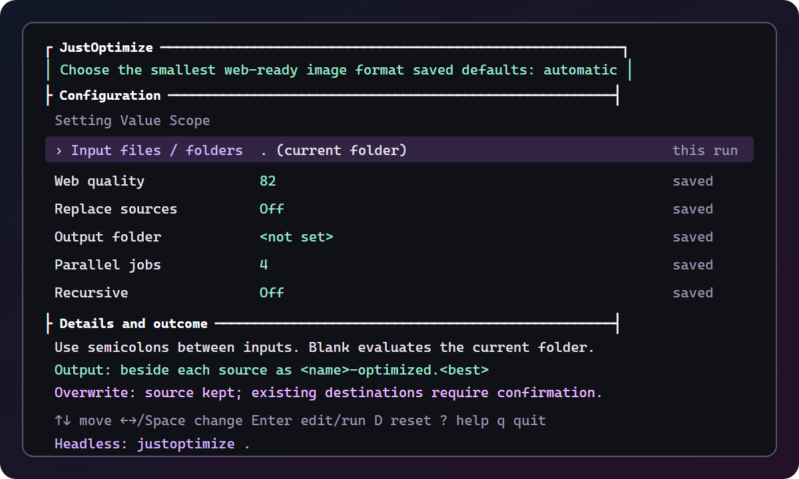

# JustTools

Fast, safe `just*` utilities in one portable Rust binary. Run a tool bare for
its console UI, or pass arguments for the same headless command.





## Install

The bootstrap downloads the correct GitHub release, verifies its SHA-256
checksum, installs every native alias, and opens JustReady.

**Windows (PowerShell)**

```powershell
irm https://raw.githubusercontent.com/JustGains/JustTools/main/ready.ps1 | iex
```

**macOS / Linux**

```sh
curl -fsSL https://raw.githubusercontent.com/JustGains/JustTools/main/ready.sh | sh
```

Reopen the terminal if the installer adds JustTools to `PATH`. Releases support
Windows, macOS, and Linux on x64 and ARM64.

## Use

```sh
just                 # browse every tool
justvideo            # interactive console
justvideo clip.mov   # direct/headless execution
justoptimize hero.png --dry-run
justrmbg portrait.jpg
```

Every bare tool has the same controls: arrow keys change settings, `Enter`
edits or runs, `D` resets its saved defaults, `?` opens help, and `q` quits.
Rows marked **saved** persist immediately. Inputs, credentials, confirmations,
and one-run actions never persist. The bottom line always shows the exact
**Headless:** command.

| Need | Commands |
| --- | --- |
| Images | `justoptimize`, `justcrop`, `justjpg`, `justpng`, `justwebp`, `justavif`, `justresize`, `justrmbg` |
| Audio and video | `justaudio`, `justmp3`, `justwav`, `justvideo` |
| Documents and data | `justjson`, `justpdf`, `justsvg`, `justqr` |
| Development | `justports`, `justport`, `bunt`, `justcommit`, `justzip` |
| Setup | `justready` |

Use `<command> --help` for every option. Direct aliases also work as short
dispatch, such as `just optimize`, `just ports`, and `just rmbg`.

## Safe image output

The console shows both the resolved output location and overwrite policy before
anything runs.

| Tool | Default result | Source |
| --- | --- | --- |
| `justwebp photo.png` | `photo.webp` beside the input | Removed only after a smaller WebP is safely installed |
| `justwebp photo.png --output web` | `web/photo.webp` | Kept |
| `justoptimize photo.png` | `photo-optimized.<best>` beside the input | Kept |
| `justrmbg photo.jpg` | `photo-nobg.png` beside the input | Kept |

`justoptimize` encodes real PNG, WebP, and eligible JPEG candidates, preserves
alpha when transparency is needed, and keeps the smallest useful web result.
Use `--output` for copies or explicit `--replace` when replacement is intended.

`justrmbg` automatically acquires its checksum-pinned ONNX Runtime and BRIA
RMBG-2.0 model when launched interactively. Headless automation grants the same
permission with `--download`; `justrmbg --check` tests the runtime first without
downloading the model. BRIA's model weights require a separate license for
commercial use.

For complete behavior, see the [console UI](docs/console-ui.md),
[JustPorts](docs/ports.md), [bunt](docs/bunt.md),
[JustCommit](docs/commit.md), and [JustReady](docs/ready.md) guides.

## Agent skill

The repository includes a client-neutral skill at
[`skills/justtools/SKILL.md`](skills/justtools/SKILL.md), detailed command
references, eval prompts, and OpenAI agent metadata.

```sh
npx skills add JustGains/JustTools --skill justtools
```

Repository agents should also follow [`AGENTS.md`](AGENTS.md). The skill teaches
agents to use explicit headless arguments, preview batch changes, preserve
sources by default, and verify outputs.

## Build and release

```sh
cargo test --locked --workspace --all-targets
cargo build --locked --release -p justtools
./target/release/just install
```

Rust 1.90 is the minimum supported toolchain. Version tags build and publish
checksummed archives for all six supported OS/architecture targets through
[`native.yml`](.github/workflows/native.yml). Each archive includes the brief
README, complete guides, screenshots, agent instructions, and installable skill.

MIT licensed. Third-party notices ship in
[`THIRD_PARTY_LICENSES.md`](THIRD_PARTY_LICENSES.md).
