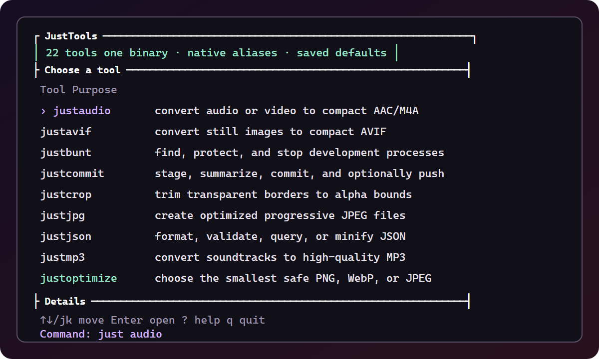
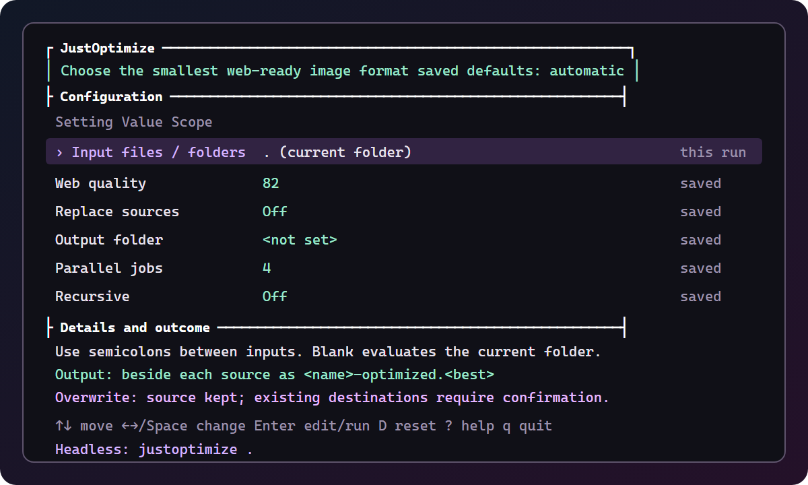

# JustTools

Fast, safe `just*` utilities in one portable Rust binary. Run a tool bare for
its console UI, or pass arguments for the same headless command.





## Install

The bootstrap downloads the correct GitHub release, verifies its SHA-256
checksum, installs every native alias, and opens JustReady.

**Windows (PowerShell)**

```powershell
irm https://raw.githubusercontent.com/JustGains/JustTools/main/ready.ps1 | iex
```

**macOS / Linux**

```sh
curl -fsSL https://raw.githubusercontent.com/JustGains/JustTools/main/ready.sh | sh
```

Reopen the terminal if the installer adds JustTools to `PATH`. Releases support
Windows, macOS, and Linux on x64 and ARM64.

## Use

```sh
just                 # browse every tool
justvideo            # interactive console
justvideo clip.mov   # direct/headless execution
justvideo clip.mov --resolution 1080p      # 480p, 720p, 1080p, 1440p, 4k, source
justaudio https://example.com/watch?v=ID   # yt-dlp download, then convert
justpaste --clipboard                      # download whatever the copied link is
justoptimize hero.png --dry-run
justrmbg portrait.jpg
```

Every bare tool has the same controls: arrow keys change settings, `Enter`
edits or runs, `D` resets its saved defaults, `?` opens help, and `q` quits.
Rows marked **saved** persist immediately. Inputs, credentials, confirmations,
and one-run actions never persist. The bottom line always shows the exact
**Headless:** command.

| Need | Commands |
| --- | --- |
| Images | `justoptimize`, `justcrop`, `justjpg`, `justpng`, `justwebp`, `justavif`, `justresize`, `justrmbg` |
| Audio and video | `justaudio`, `justmp3`, `justwav`, `justvideo` (also accept `http(s)` URLs) |
| Downloads | `justpaste` saves any link: a file as-is, a page through yt-dlp |
| Documents and data | `justjson`, `justpdf`, `justlinks`, `justsvg`, `justqr` |
| Development | `justports`, `justport`, `justip`, `bunt`, `justcommit`, `justzip` |
| Setup | `justready` |
| Shell helpers | `mkcd`, `claude_`, `codex_` (automatic in Windows PowerShell) |
| File Explorer | `just context install` adds a right-click menu on Windows |

Use `<command> --help` for every option. Direct aliases also work as short
dispatch, such as `just optimize`, `just ports`, and `just rmbg`.

Windows installations include PowerShell launchers: use `mkcd`, `claude_`, and
`codex_` directly, with no `init` command or profile edit. On macOS/Linux, enable
helpers in Bash/Zsh with
`eval "$(just init bash)"` / `eval "$(just init zsh)"`, or in Fish with
`just init fish | source`. Add that line to your shell profile to keep it.
`mkcd my-folder` creates and enters one directory; `mkcd -p parent/child`
also creates missing parents. `claude_` runs `claude --dangerously-skip-permissions`
and `codex_` runs `codex --yolo`, forwarding additional arguments.
See the [shell helpers guide](docs/mkcd.md).

## Windows right-click menu

`just context install` adds **JustTools** to the File Explorer context menu for
the current user. Right-click a video for JustVideo at 480p, 720p, 1080p,
1440p, or 4K and JustMP3/JustAudio/JustWAV; an image for JustOptimize,
JustResize sizes, WebP/AVIF/JPEG conversion, JustCrop, and JustRMBG; a PDF,
SVG, JSON file, or document for the tools that read it; and a folder or its
background for **JustPaste**, which downloads the copied link into it. Each entry
opens a console showing its **Headless:** command, and sources are kept unless
an entry says "in place". On Windows 11 the top-level menu needs a signed
release package or Developer Mode; otherwise the menu sits under "Show more
options". See the [context menu guide](docs/context-menu.md).

## Media downloads

`justvideo`, `justaudio`, `justmp3`, and `justwav` accept an `http(s)` URL
wherever they accept a file. yt-dlp downloads it to a temporary folder and the
tool converts it with its usual settings into the current folder, or `--output`.
The download is never kept and `--playlist` opts into multi-entry links.
A missing yt-dlp or FFmpeg is downloaded automatically and verified, and
yt-dlp is updated whenever twelve hours have passed. See the
[downloads guide](docs/downloads.md).

## Safe image output

The console shows both the resolved output location and overwrite policy before
anything runs.

| Tool | Default result | Source |
| --- | --- | --- |
| `justwebp photo.png` | `photo.webp` beside the input | Removed only after a smaller WebP is safely installed |
| `justwebp photo.png --output web` | `web/photo.webp` | Kept |
| `justoptimize photo.png` | `photo-optimized.<best>` beside the input | Kept |
| `justrmbg photo.jpg` | `photo-nobg.png` beside the input | Kept |

`justoptimize` encodes real PNG, WebP, and eligible JPEG candidates, preserves
alpha when transparency is needed, and keeps the smallest useful web result.
Use `--output` for copies or explicit `--replace` when replacement is intended.

`justrmbg` automatically acquires its checksum-pinned ONNX Runtime and BRIA
RMBG-2.0 model when launched interactively. Headless automation grants the same
permission with `--download`; `justrmbg --check` tests the runtime first without
downloading the model. BRIA's model weights require a separate license for
commercial use.

`justpdf images guide.pdf` saves every embedded image, copying JPEGs unchanged
and keeping transparency as PNG. `justlinks guide.pdf plan.xlsx --csv` writes
every unique link from PDFs, Office, and text files with its title, file, and
location; add `--recursive` for folders. Matching ignores casing; YouTube watch,
short, Shorts, live, and embed URLs merge into one clean video link without
timestamps, tracking, or playlist parameters.

For complete behavior, see the [console UI](docs/console-ui.md),
[context menu](docs/context-menu.md), [JustPaste](docs/paste.md), [JustPDF](docs/pdf.md), [JustLinks](docs/links.md), [JustPorts](docs/ports.md), [JustIP](docs/ip.md),
[bunt](docs/bunt.md), [JustCommit](docs/commit.md), [media downloads](docs/downloads.md), and
[JustReady](docs/ready.md) guides.

## Agent skill

The repository includes a client-neutral skill at
[`skills/justtools/SKILL.md`](skills/justtools/SKILL.md), detailed command
references, eval prompts, and OpenAI agent metadata.

```sh
npx skills add JustGains/JustTools --skill justtools
```

Repository agents should also follow [`AGENTS.md`](AGENTS.md). The skill teaches
agents to use explicit headless arguments, preview batch changes, preserve
sources by default, and verify outputs.

## Build and release

```sh
cargo test --locked --workspace --all-targets
cargo build --locked --release -p justtools
./target/release/just install
```

On Windows, add `-p justtools-shell` to build the File Explorer extension that
`just install` copies beside the executable.

Rust 1.90 is the minimum supported toolchain. Version tags build and publish
checksummed archives for all six supported OS/architecture targets through
[`native.yml`](.github/workflows/native.yml). Each archive includes the brief
README, complete guides, screenshots, agent instructions, and installable skill;
Windows archives also carry the File Explorer extension.

MIT licensed. Third-party notices ship in
[`THIRD_PARTY_LICENSES.md`](THIRD_PARTY_LICENSES.md).
