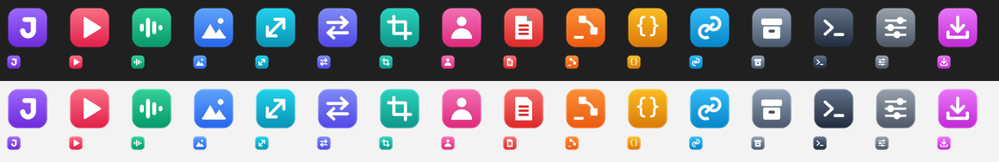

# File Explorer context menu (Windows)

JustTools can add itself to the right-click menu in File Explorer. The menu
only appears on things a tool can read, and only lists the tools that apply to
the selection.

```powershell
just context install     # add the menu for the current user
just context status      # which registration is active
just context uninstall   # remove everything install added
```

No elevation is needed and nothing outside the current user is changed.



## What the menu shows

| Right-click | Entries |
| --- | --- |
| Video (`.mp4 .mov .mkv .avi .webm` …) | **JustVideo** at 480p, 720p, 1080p, 1440p, 4K, or source resolution, plus more options…; **JustMP3**, **JustAudio**, **JustWAV** to extract the soundtrack |
| Audio (`.mp3 .wav .flac .m4a .ogg` …) | **JustMP3**, **JustAudio**, **JustWAV**, minus the format the file already has |
| Image (`.jpg .png .webp .bmp .tif .qoi`) | **JustOptimize**; **JustResize** to fit 1024, 1920, 2560, or 3840 px, plus more options…; **JustWebP**, **JustAVIF**, **JustJPG**, **JustPNG**; **JustCrop**, **JustRMBG** |
| PDF | **JustPDF** merge (two or more), split into pages, save embedded images, save links, show details, more options…; **JustLinks** |
| SVG / JSON | **JustSVG**; **JustJSON** format, minify, validate |
| Office, Markdown, HTML, text, CSV | **JustLinks** to `links.txt` or `links.csv` |
| Folder, or a folder's empty background | **JustPaste** downloads the copied link into that folder; JustOptimize, JustResize, JustWebP, JustVideo, JustMP3, and JustLinks launchers opened in that folder; **JustZip** when the folder is a Git working tree |

Every choice is its own row in the JustTools flyout, such as
**JustVideo · 1080p**. The Windows 11 menu does not draw a flyout nested inside
another, so the menu is one level deep by design.

Every menu ends with **Open JustTools here**, which opens the `just` tool
browser in that folder. `.ts` and `.mts` are left alone because they are far
more often TypeScript than video.

A mixed selection shows every tool that can read at least one selected file,
and each tool is given only the files it reads.

## What a click does

A console window opens, prints the exact **Headless:** command and the folder
it runs in, and runs it. That command is what a terminal user would type, so
the menu never does anything the command line cannot.

- Every window closes by itself: after about three seconds when the run
  succeeded, and after thirty when it failed or the result is something to read
  (PDF details, JSON validation).
- Enter closes it at once; any other key stops the countdown and keeps the
  window open until Enter.
- Entries ending in **…** open the tool's [console launcher](console-ui.md)
  with the selection filled in, so saved defaults and every option apply.

## Defaults

Menu entries use each tool's built-in defaults plus the one setting the entry
names; saved launcher defaults apply only to the **…** entries.

| Entry | Command | Result |
| --- | --- | --- |
| JustVideo · 1080p | `justvideo --resolution 1080p` | `<name>-web.mp4`, never upscaled, source kept |
| JustMP3 / JustAudio / JustWAV | `justmp3`, `justaudio`, `justwav` | `<name>.mp3` / `.m4a` / `.wav`, source kept |
| JustOptimize | `justoptimize` | `<name>-optimized.<best>`, source kept |
| JustResize · fit 2560 px | `justresize --max 2560` | `<name>-resized.<same>`, source kept |
| JustWebP / JustAVIF | `justwebp --output .`, `justavif --output .` | `<name>.webp` / `.avif` beside the source, **source kept** |
| JustJPG | `justjpg` | `<name>-optimized.jpg`, source kept |
| JustPNG · compress in place | `justpng` | Replaces the PNG only when the result is smaller |
| JustCrop / JustRMBG | `justcrop`, `justrmbg` | `<name>-cropped.<same>` / `<name>-nobg.png`, source kept |
| JustPaste | `justpaste --clipboard` | The copied link's file in that folder; a taken name is numbered, never overwritten |
| JustSVG, JustJSON Format/Minify | `justsvg`, `justjson`, `justjson --minify` | Rewrites the file in place |

Entries that change a file in place say so. JustWebP and JustAVIF normally
remove a source once a smaller result exists; the menu passes `--output .` so
a right-click never deletes anything. The menu never passes `--yes`, so a tool
that would overwrite an existing result still asks in the console window.

## Windows 11 top-level menu

Windows 11 only lets an app with a package identity into its top-level menu.
`just context install` uses the best registration available:

| Registration | Appears | Needs |
| --- | --- | --- |
| Package | Top-level Windows 11 menu | A signed `justtools-shell.msix` beside `just.exe`, **or** Developer Mode (Settings > System > For developers) |
| Classic | "Show more options" on Windows 11 (also Shift+right-click); the normal menu on Windows 10 | Nothing |

`just context install --classic` forces the classic registration. Only one
registration is active at a time. `just install` refreshes a menu that the
installed copy registered, and leaves a menu registered by another copy alone.

The menu is served by `justtools_shell.dll`, which ships in the Windows release
archives and is copied beside `just.exe` by `just install`. When building from
source, build it too:

```sh
cargo build --locked --release -p justtools -p justtools-shell
./target/release/just install
just context install
```

Release signing is optional. When the release workflow is given the
`JUSTTOOLS_SIGNING_PFX` (base64 PFX) and `JUSTTOOLS_SIGNING_PASSWORD` secrets,
it packs and signs `justtools-shell.msix` into the Windows archives; the
certificate must chain to a root the user's machine trusts.

## How it is built

- `explorer/menu` is the menu itself: which tools read which extensions, the
  entries for a selection, and the command behind each entry. It is plain Rust,
  tested on every platform, and shared by the extension and the CLI.
- `explorer/shell` is the Explorer extension (`IExplorerCommand`). It asks the
  model what to show and starts `just.exe context run <entry>`.
- `explorer/icons/build.py` draws the icons; the generated files are committed.
